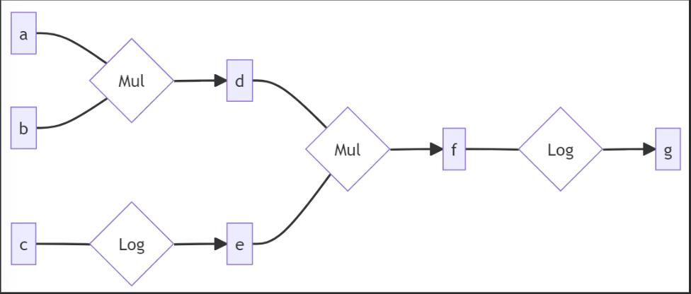

# Juan’s ML Notes

This site collects my notes + implementations (math included).

## Backpropagation from Scratch

```python
import re
import time
from dataclasses import dataclass
from typing import Any, Callable, Iterable, Iterator
import numpy as np

Arr = np.ndarray
grad_tracking_enabled = True
```

We will implement backpropagation from scratch.  
Read [this](https://colah.github.io/posts/2015-08-Backprop/) for a basic understanding of backprop.

So, for example our backwards function of log would be:

```python
def log_back(grad_out, out, x):
    return grad_out / x
```

In general, we are working with tensors, where we might have something like `out = x + y` where `x.shape = (2,)` and `y.shape = (4,2)`. Then what’s happening under the hood is we **[broadcast](https://docs.pytorch.org/docs/stable/notes/broadcasting.html)** to some $x_b$ which has the shape of $y$, and then define:

$$
\text{out} = x_b + y
$$

Now, how do we go from $\frac{\partial L}{\partial x_b}$ to finding $\frac{\partial L}{\partial x}$?

Let $x \in \mathbb{R}^d$ and let $x_b$ be its broadcasted version with:

$$
x_b[i_1, \dots, i_k, j] = x[j]
$$

Let $L = L(x_b)$. Then for each $j$:

$$
\frac{\partial L}{\partial x[j]} = \sum_{i_1, \dots, i_k} \frac{\partial L}{\partial x_b[i_1, \dots, i_k, j]} \cdot \frac{\partial x_b[i_1, \dots, i_k, j]}{\partial x[j]}
$$

Since the derivative of the broadcasted element with respect to the original is:

$$
\frac{\partial x_b[i_1, \dots, i_k, j]}{\partial x[j]} = 1
$$

We obtain the final reduction formula:

$$
\boxed{\frac{\partial L}{\partial x[j]} = \sum_{i_1, \dots, i_k} \frac{\partial L}{\partial x_b[i_1, \dots, i_k, j]}}
$$

Equivalently, in gradient notation:

$$
\boxed{\nabla_x L = \sum_{\text{broadcast axes}} \nabla_{x_b} L}
$$

```python
def unbroadcast(broadcasted, original):
    b = broadcasted

    ndims = b.ndim - original.ndim
    if ndims > 0:
        b = b.sum(axis=tuple(range(ndims)))

    if original.ndim > 0:
        dims = tuple(i for i, (o, bi) in enumerate(zip(original.shape, b.shape)) if o == 1 and bi != 1)
        if len(dims) > 0:
            b = b.sum(axis=dims, keepdims=True)

    assert b.shape == original.shape
    return b
```

Indeed, functions can be differentiable wrt more than one input tensor, in which case we need multiple backwards functions, one for each input argument.

For example, we can write the backwards functions for $x*y$ wrt argument 0 and 1 ($x$ and $y$ respectively):

```python
def multiply_back0(grad_out, out, x, y):
    if not isinstance(y, Arr):
        y = np.array(y)
    return unbroadcast(grad_out * y, x)

def multiply_back1(grad_out, out, x, y):
    if not isinstance(x, Arr):
        x = np.array(x)
    return unbroadcast(grad_out * x, y)
```

Now, let's try out our backward functions and do backpropagation on this computational graph:



```python
def forward_and_back(a, b, c):
    d = np.multiply(a, b)
    e = np.log(c)
    f = np.multiply(d, e)
    g = np.log(f)

    go = np.ones_like(g)

    gf = log_back(go, g, f)
    gd = multiply_back0(gf, f, d, e)
    ge = multiply_back1(gf, f, d, e)

    ga = multiply_back0(gd, d, a, b)
    gb = multiply_back1(gd, d, a, b)
    gc = log_back(ge, e, c)

    return ga, gb, gc
```
